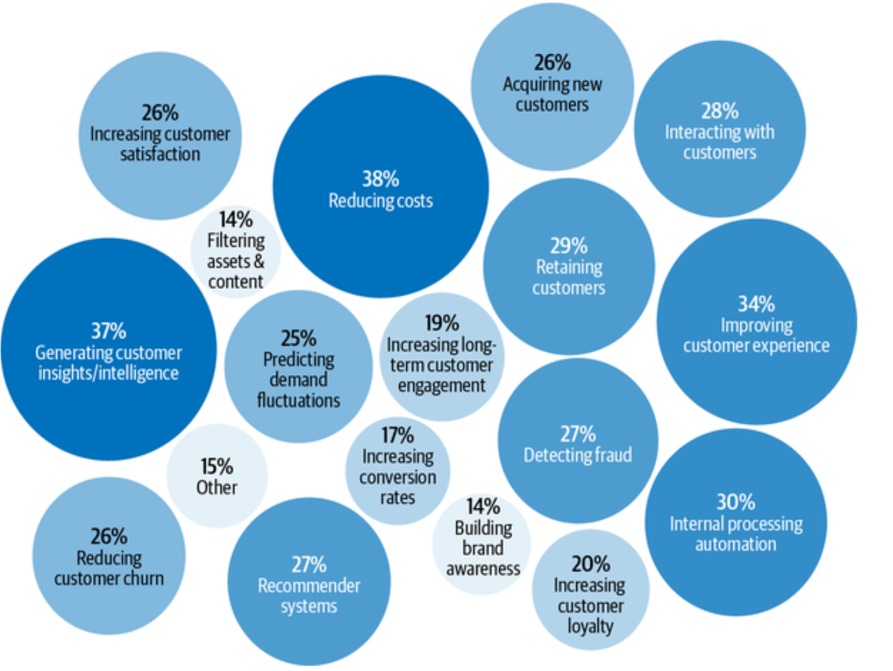
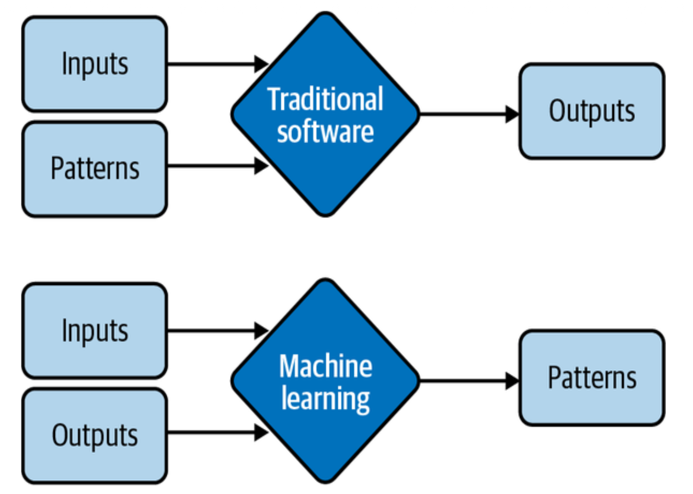
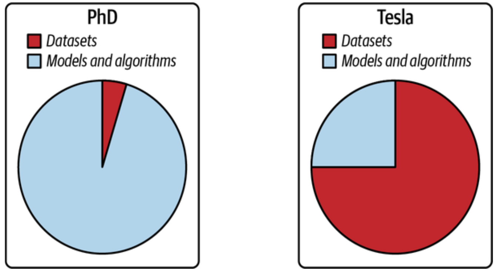
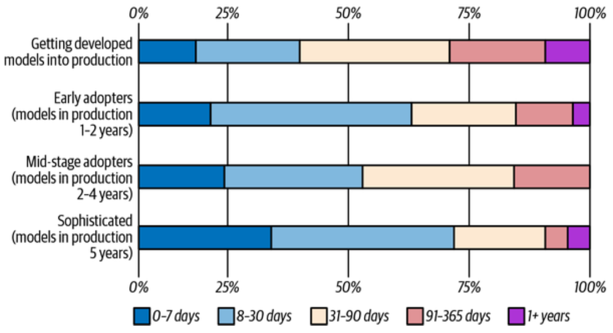
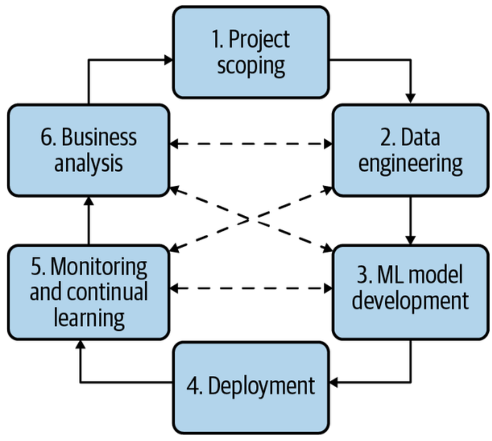
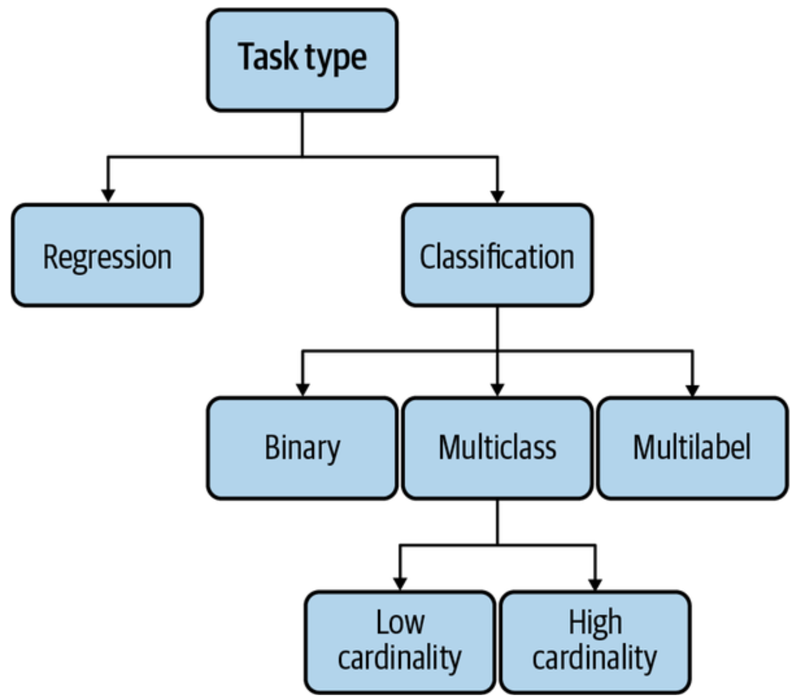
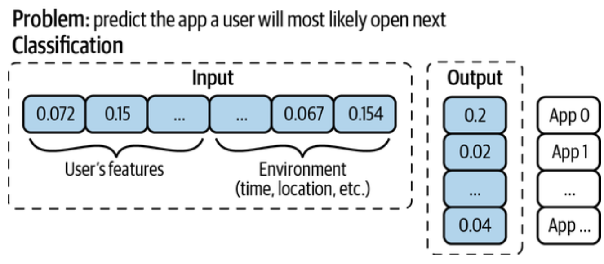
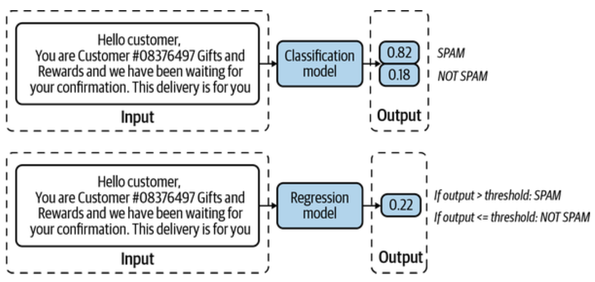
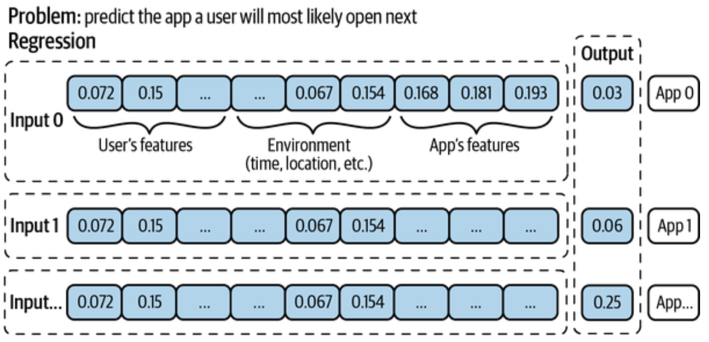
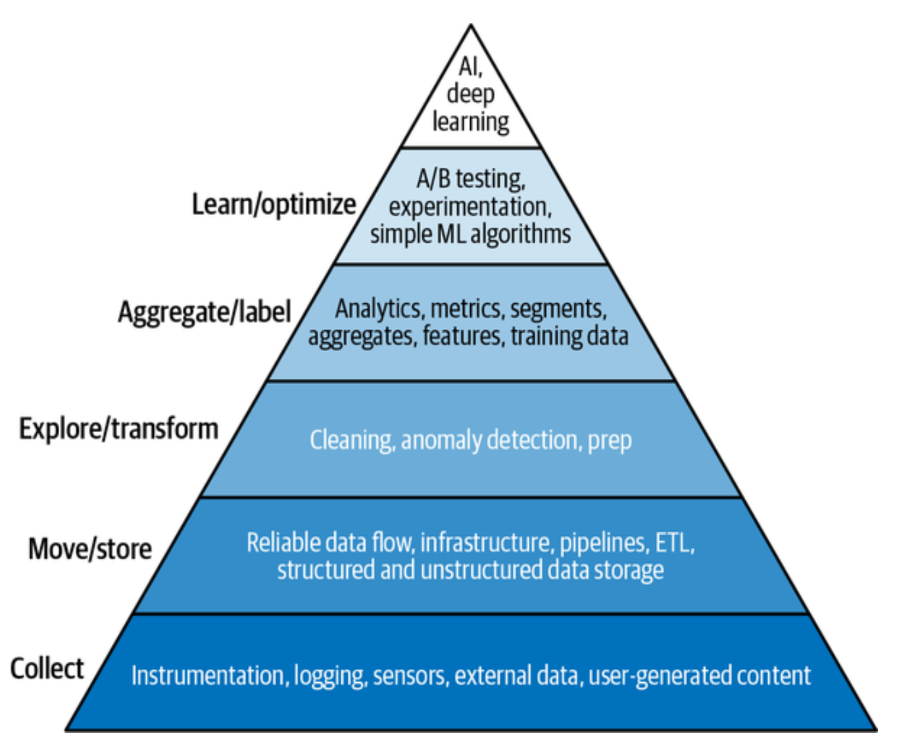

## AI application

## ML Systems vs. Traditional Software

## Development vs. Production

## Concerns in development

- **Fairness** is often an afterthought in research but a **requirement in production**
- Biased algorithms can **discriminate at scale** against minority groups
- **Interpretability** is required for users to trust the system and for developers to debug it
- Business leaders often prefer a **human expert** over a "black box" AI if the AI can't explain its decision
- Only a small percentage of companies currently take steps to **mitigate algorithmic bias**

## Engineering Challenges in ML

- Modern ML models can have **billions of parameters**, requiring massive RAM
- Deploying large models on **edge devices** is a major engineering challenge
- ML models often **fail silently**, making monitoring and debugging difficult
- Speed of inference is critical; a slow autocomplete model is **useless**
- Engineering challenges for models like **BERT** are being solved at a breakneck pace

## Business and ML Objectives

- Most businesses only care about **profit maximization**
- ML metrics (like F1 score) must be **translated into business metrics** (like revenue)
- **Ad click-through rates** are popular because they map directly to revenue
- Netflix uses **"take-rate"** to bridge the gap between recommendations and streaming hours
- **Experiments (A/B testing)** are often needed to find the actual relationship between metrics

## Returns on Investment (ROI)

- ML gain doesn't happen **overnight**; Google has invested for decades
- ROI depends on the **maturity stage** of ML adoption
- Sophisticated companies can deploy models in **under 30 days**
- Early adopters spend more time on engineering and have **higher cloud bills**
- Efficiency increases as the **ML pipeline matures**

## Adoption rate

## 4 requirements for production ML

1. **Reliability**
2. **Scalability**
3. **Maintainability**
4. **Adaptability**

## Requirement: Reliability

- The system must perform **correctly even in the face of faults**
- **Correctness** is harder to define in ML than in traditional software
- ML models can **fail silently**, serving wrong predictions without crashing
- System health must be monitored to ensure it meets **performance expectations**
- Reliability includes handling **hardware, software, and human errors**

## Requirement: Scalability

- Systems must handle growth in **complexity, traffic, and model count**
- **Autoscaling** is a standard cloud feature but can be tricky to implement
- Scalability involves **resource scaling** (GPUs/CPUs) and **artifact management**
- Managing **thousands of models** requires automated monitoring and retraining
- Handling growth requires **reproducible code generation**

## Requirement: Maintainability

- Different roles (ML engineers, DevOps, SMEs) must **collaborate using comfortable tools**
- **Documentation and versioning** of code, data, and artifacts are essential
- Models must be **reproducible** so new contributors can build on old work
- Infrastructure should support **cross-functional visibility**
- Maintainability ensures that teams can **identify and fix problems** without finger-pointing

## Requirement: Adaptability

- Systems must **evolve quickly** to handle shifting data and business needs
- Adaptability is tightly linked to **maintainability**
- The system should have capacity for **discovering performance improvements**
- Updates should happen **without service interruption**
- This requires infrastructure for **continual learning** and monitoring for shifts

## The ML Lifecycle

## Framing ML Problems

- A problem must be defined by **inputs, outputs, and an objective function**
- The difficulty of a task changes based on **how it is framed**
- Common task types include **classification and regression**
- A task can be **reframed** (e.g., house price prediction as classification buckets)
- Choosing the right framing can make a problem **significantly easier** to solve

## Task types

## Framing for Simple Solutions

- Reframing a task can avoid **frequent retraining**
- Instead of predicting a probability for every app on a phone (**classification**), use app features as input (**regression**)
- In the regression framing, adding a new app doesn't require **retraining from scratch**
- This makes the model **more scalable and flexible**
- The output in the regression frame is a **single value** denoting likelihood of use

## Examples

## Examples

## Examples

## Objective Functions

- Guided by a **loss function** to minimize errors from wrong predictions
- In supervised learning, the model compares outputs to **ground truth labels**
- Common functions include **RMSE** for regression and **cross-entropy** for classification
- Choosing a function requires **algebra knowledge**, but most use standard ones
- The objective function is **different from business objectives**

## Decoupling Conflicting Objectives

- Systems often have **multiple goals**, such as engagement vs. quality
- Conflicting objectives make it hard to rank items **using a single model**
- One approach combines losses into a **weighted sum**, but requires retraining to tune
- A better approach is to **train separate models** for each objective and combine scores
- Decoupling makes **maintenance easier** as different goals shift at different rates

## The Role of Data

## Quality over Quantity

- **More data isn't always better**
- **Incorrect labels** in training data can hurt model performance
- **Outdated data** prevents the model from generalizing to current trends
- Success relies on **managing and improving data quality**
- Data scientists must be wary of **poisoning or noise** in their datasets

## Specific Requirements

- EMA Reflection Paper on Artificial Intelligence
- Annex 11 Revision Draft document
- Annex 22 Draft
- GAMP 5 D11
- Supporting framework conditions (QRM, data integrity, change Management)

