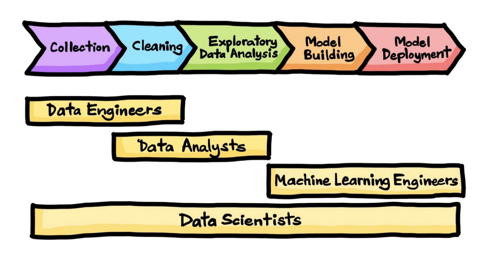

## Data Engineering

- data: scraping, API, feature engineering, all part of EDA
- compute: python, R, julia
- storage/database: pandas, SQL, NoSQL, HBase, disk, memory
- flow: Pandas, Apache Airflow, Prefect, Luigi

## Data sciences workflow

{height="400px"}^[https://www.springboard.com/blog/data-science/data-science-process/]

## Downloading: file format

- Excel
- JSON
- table: CSV, TSV
- XML: HTML

## JSON

```{json}
{
    "name": "John",
    "age": 30,
    "city": "New York"
}
```

## CSV

```{csv}
name,age,city
John,30,New York
```

## TSV

```{tsv}
name	age	city
John	30	New York
```

## API (Application Programming Interface)

- REST
- GraphQL

## Web scraping

copyrights and permission:

- be careful and polite
- give credit
- care about media law
- don't be evil (no spam, overloading sites, etc.)

## HTML

Tags are in angle brackets
should be in pairs, eg `<p>Hello</p>`
maybe in implicit tags, such as `<br/>`

```{html}
<!DOCTYPE html>
<html>
<head>
	<title>Title</title>
</head>
<body>
	<h1>Body Title</h1>
	<p >Body Content</p>
	</body>
</html>
```

## Developer Tools

ctrl/cmd shift- i in chrome
cmd-option-i in safari
look for "inspect element"
locate details of tags

## BeautifulSoup

```{python}
#| eval: false


import bs4

tree = bs4.BeautifulSoup(source)

## get html root node
root_node = tree.html
## get head from root using contents
head = root_node.contents[0]
## get body from root
body = root_node.contents[1]
## could directly access body
tree.body
```

## Relational Database

- Tables, Rows, and Columns
- Keys
- Primary Key (PK)
- Foreign Key (FK)
- Structured Query Language (SQL)
- ACID Properties

## ACID

- **Atomicity** - each statement in a transaction Either the entire statement is executed, or none of it is executed
- **Consistency** - ensures that transactions only make changes to tables in predefined, predictable ways.
- **Isolation** - when multiple users are reading and writing from the same table all at once, isolation of their transactions ensures that the concurrent transactions don't interfere with or affect one another
- **Durability** - ensures that changes to your data made by successfully executed transactions will be saved, even in the event of system failure.

# NoSQL features, strengths and challenges

## [Motivations for Not Just/No SQL (NoSQL) Databases]{.r-fit-text}

**Scalability**: ability to efficiently meet the needs for varying workloads

**Cost**: opensource

**Flexibility**: do not require a fixed table structure

**Availability**: distributed

## NoSQL comparison

| | Document | Column Store | Key-Value Store | Graph |
|-----|-----|-----|-----|-----|
| Performance | High | High | High | Moderate |
| Availability | High | High | High | High |
| Flexibility | High | Moderate | High | High |
| Scalability | High | High | High | Moderate |
| Complexity | Low | Low | Moderate | High |

## Data Wrangling Steps

- Iterative process
- Understand
- Explore
- Transform
- Augment
- Visualize

## Scales of Measurement^[S. S. Stevens, Science, New Series, Vol. 103, No. 2684 (Jun. 7, 1946), pp. 677-680]

- Quantitative (Interval and Ratio) 
- Ordinal
- Nominal

## The basic Exploratory Data Analysis (EDA) workflow

1. Import data into a DataFrame
2. Tidy the DataFrame
    - Each row describes a single object
    - Each column describes a property of that object
    - Columns are numeric whenever appropriate
    - Columns contain atomic properties that cannot be further decomposed
3. Data Cleansing: Missing values, Format, Measurement Units, Outliers, Data Errors Per Domain
4. Explore global properties. Use histograms, scatter plots, and aggregation functions to summarize the data.
5. Explore group properties. Use groupby, queries, and small multiples to compare subsets of the data.

## Grammar of Data

- SQL, Pandas, formalized in dplyr4
- provide simple verbs for simple things. These are functions corresponding to common data manipulation tasks.
- second idea is that backend does not matter, multiple backends implemented in Pandas, Spark, Impala, Pig, dplyr, ibis, blaze

## Grammar of Data

Why bother?
- learn how to do core data manipulations, no matter what the system is.
- databases critical for non-memory fits. 

## Grammar of Data: cleaning and transforma1on
| VERB                      | dplyr                        | pandas                      | SQL                            |
| ------------------------- | ---------------------------- | --------------------------- | ------------------------------ |
| QUERY/SELECTION           | filter() (and slice())       | query() (and loc[], iloc[]) | SELECT WHERE                   |
| SORT                      | arrange()                    | sort()                      | ORDER BY                       |
| SELECT-COLUMNS/PROJECTION | select() (and rename())      | (and rename())              | SELECT COLUMN                  |
| SELECT-DISTINCT           | distinct()                   | unique(),drop_duplicates()  | SELECT DISTINCT COLUMN         |
| ASSIGN                    | mutate() (and transmute())   | assign                      | ALTER/UPDATE                   |
| AGGREGATE                 | summarise()                  | describe(), mean(), max()   | None, AVG(),MAX()              |
| SAMPLE                    | sample_n() and sample_frac() | sample()                    | implementation dep, use RAND() |
| GROUP-AGG                 | group_by/summarize           | groupby/agg, count, mean    | GROUP BY                       |
| DELETE                    | ?                            | drop/masking                | DELETE/WHERE                   |

## Data processing

- OLTP: Online Transaction Processing
- OLAP: Online Analytic Processing
- RTAP: Real-Time Analytic Processing


