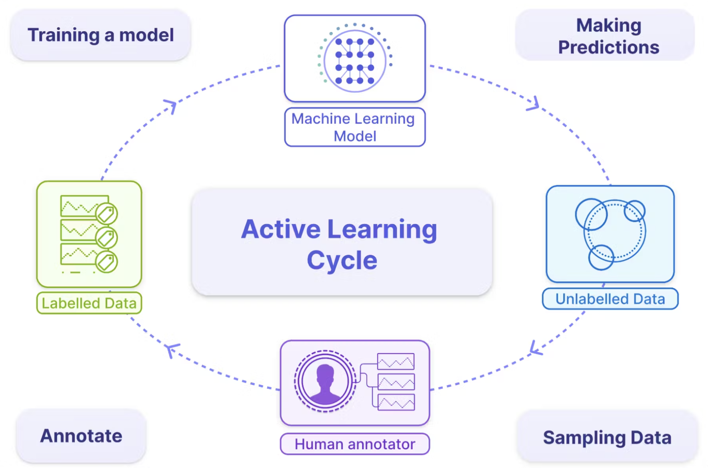

## Overview: The Role of Training Data

* **Context**: While ML curricula often focus on modeling, practitioners spend a significant amount of time wrangling training data.
* **Impact**: No matter how clever the algorithm, bad training data leads to poor performance.
* **Core Topics**:
    * Sampling Methods
    * Labeling Challenges
    * Class Imbalance
    * Data Augmentation

## Sampling: Probability vs. Nonprobability

Sampling is the first step in creating training data.

- **Nonprobability Sampling**: Based on convenience or availability (e.g., convenience, snowball, judgment, or quota sampling). These often suffer from selection bias.
- **Simple Random Sampling**: Every member of the population has an equal chance of being selected.
- **Stratified Sampling**: The population is divided into groups (strata), and each group is sampled separately to ensure representation.

## Train-Test Split with Scikit-Learn

The most basic sampling method is splitting your dataset into training and testing sets.

```python
from sklearn.model_selection import train_test_split
import numpy as np

X, y = np.arange(10).reshape((5, 2)), range(5)

# Split dataset: 80% training, 20% testing
X_train, X_test, y_train, y_test = train_test_split(
    X, y, test_size=0.2, random_state=42
)

print("Training data:\n", X_train)
print("Testing data:\n", X_test)
```

## Stratified Sampling

When classes are imbalanced, random splitting might result in a test set with no examples of the minority class. **Stratified sampling** ensures the class distribution is preserved.

```python
# y has an imbalance: class 0 (8 samples), class 1 (2 samples)
y_imbalanced = [0, 0, 0, 0, 0, 0, 0, 0, 1, 1]
X_imbalanced = np.arange(20).reshape((10, 2))

# Stratify ensure both train and test sets have class 1
X_train, X_test, y_train, y_test = train_test_split(
    X_imbalanced, y_imbalanced, test_size=0.2, 
    stratify=y_imbalanced, random_state=42
)

print("Test class distribution:", y_test) 
# Likely to include both classes or at least proportional representation
```

## Resampling with Scikit-Learn

You can manually resample your data (upsample minority or downsample majority) using `sklearn.utils.resample`.

```python
from sklearn.utils import resample

# Upsample minority class (class 1)
X_upsampled, y_upsampled = resample(
    X_imbalanced[y_imbalanced == 1],
    y_imbalanced[y_imbalanced == 1],
    replace=True,     # sample with replacement
    n_samples=4,      # match number of majority class or desired number
    random_state=42
) 
print("Upsampled class 1:", y_upsampled)
```

## Handling the Lack of Labels

Labeling is often expensive and slow. Four major techniques to address this include:

1.  **Semi-Supervision**: Uses a small set of initial labels as "seeds" to generate more labels based on structural assumptions.
2.  **Active Learning**: The model identifies which unlabeled samples would be most useful to learn from and queries a human for those specific labels.
3.  **Transfer Learning**: Leverages models pretrained on a different (often abundant) task as a starting point.

## Semi-Supervised: Self-Training

**Self-training** involves training a model on labeled data, predicting labels for unlabeled data, and adding high-confidence predictions to the training set.

```python
import numpy as np
from sklearn import datasets
from sklearn.semi_supervised import SelfTrainingClassifier
from sklearn.svm import SVC

rng = np.random.RandomState(42)
iris = datasets.load_iris()

X = iris.data

# random select 30% of the data as unlabeled unlabeled are masked with -1

y_with_unlabeled = iris.target
random_unlabeled_points = rng.rand(X.shape[0]) < 0.3
y_with_unlabeled[random_unlabeled_points] = -1

svc = SVC(probability=True, gamma="auto")
self_training_model = SelfTrainingClassifier(svc)
self_training_model.fit(X, y_with_unlabeled)

y_with_self_training = self_training_model.predict(X)

svc.fit(X, y_with_self_training)
y_pred = svc.predict(X)
```

## Semi-Supervised: Label Spreading

**Label Spreading** propagates labels through the data graph. Points close to each other in feature space are likely to share the same label.

```python
import numpy as np
from sklearn import datasets
from sklearn.semi_supervised import LabelSpreading
from sklearn.svm import SVC

rng = np.random.RandomState(42)
iris = datasets.load_iris()

X = iris.data
y_with_unlabeled = iris.target
random_unlabeled_points = rng.rand(X.shape[0]) < 0.3
y_with_unlabeled[random_unlabeled_points] = -1

# Kernel='knn' constructs a graph using k-nearest neighbors
label_prop_model = LabelSpreading(kernel='knn', alpha=0.8)

# Fit on data with mixed labeled/unlabeled points (-1)
label_prop_model.fit(X, y_with_unlabeled)

print("Predicted labels:", label_prop_model.transduction_)

```

## Active Learning



## Active Learning: Uncertainty Sampling

In **uncertainty sampling**, we query labels for instances where the model is least confident (probability closest to 0.5).

```python
import numpy as np
from sklearn import datasets
from sklearn.semi_supervised import LabelSpreading
from sklearn.svm import SVC
from sklearn.linear_model import LogisticRegression

rng = np.random.RandomState(42)
iris = datasets.load_iris()

X = iris.data

y = iris.target

X_labeled, X_no_labeled, y_labeled, _ = train_test_split(
    X, y, test_size=0.2, random_state=42
)


# Train model on currently labeled data
clf = LogisticRegression().fit(X_labeled, y_labeled)

# Predict probabilities on pool of unlabeled data
probs = clf.predict_proba(X_no_labeled)

# Calculate uncertainty (e.g., 1 - max_probability)
uncertainty = 1 - probs.max(axis=1)

# Select top K most uncertain samples to query
query_indices = np.argsort(uncertainty)[-5:] 
print("Query these samples:", query_indices)

```

## Transfer Learning for Labeling

**Transfer Learning** (or Domain Adaptation) uses a model trained on a source domain (abundant labels) to predict on a target domain (scarce labels). High-confidence predictions can be used as "pseudo-labels".

```python
from sklearn.ensemble import RandomForestClassifier

# 1. Train on Source Domain (Abundant Labels)
clf = RandomForestClassifier().fit(X_source, y_source)

# 2. Predict on Target Domain (Key: Domain Similarity)
probs = clf.predict_proba(X_target)
preds = clf.predict(X_target)

# 3. Filter High-Confidence Predictions (Pseudo-Labeling)
confidence = probs.max(axis=1)
high_conf_mask = confidence > 0.9

X_pseudo = X_target[high_conf_mask]
y_pseudo = preds[high_conf_mask]
print(f"Generated {len(y_pseudo)} pseudo-labels")
```

## Challenges of Class Imbalance

Class imbalance occurs when there is a substantial difference in the number of samples across classes.

- **Why it's hard**: The model lacks sufficient signal to detect minority classes and may assume they don't exist.
- **Evaluation**: Accuracy is often misleading; practitioners should use **Precision, Recall, and F1 scores**.
- **Mitigation**:
  - **Data-level**: Resampling (Oversampling the minority or Undersampling the majority).
  - **Algorithm-level**: Modifying the loss function (e.g., Cost-sensitive learning or Focal loss).

## Addressing Imbalance: Class Weights

Most scikit-learn classifiers support a `class_weight` parameter to penalize mistakes on the minority class more heavily.

```python
from sklearn.linear_model import LogisticRegression
from sklearn.ensemble import RandomForestClassifier

# 'balanced' mode automatically adjusts weights inversely proportional
# to class frequencies in the input data
clf_rf = RandomForestClassifier(class_weight='balanced')
clf_lr = LogisticRegression(class_weight='balanced')

clf_rf.fit(X_train, y_train)
```

## Evaluation Metrics for Imbalance

Accuracy is misleading when classes are imbalanced (e.g., 99% accuracy if 99% of data is negative). Use **Precision**, **Recall**, and **F1-Score**.

```python
from sklearn.metrics import classification_report, confusion_matrix

y_pred = clf_rf.predict(X_test)

print(confusion_matrix(y_test, y_pred))
print(classification_report(y_test, y_pred))

# Recall: Correct positive predictions / Total actual positives
# F1-Score: Harmonic mean of Precision and Recall
```

## Library: Imbalanced-Learn

**Imbalanced-Learn** (`imblearn`) is a library compatible with scikit-learn that provides advanced re-sampling techniques.

```python
from imblearn.over_sampling import SMOTE
from imblearn.under_sampling import RandomUnderSampler
from imblearn.pipeline import Pipeline

# Pipeline: Upsample minority -> Downsample majority -> Train
model = Pipeline([
    ('over', SMOTE(sampling_strategy=0.1)),
    ('under', RandomUnderSampler(sampling_strategy=0.5)),
    ('model', RandomForestClassifier())
])

model.fit(X_train, y_train)
```


## Data Augmentation

This family of techniques increases training data volume to make models more robust to noise and adversarial attacks.

- **Simple Transformations**: Label-preserving modifications like cropping/flipping images or replacing words with synonyms in NLP.
- **Perturbation**: Adding a small amount of noise to inputs to improve the model's resilience.
- **Data Synthesis**: Creating entirely new data samples from scratch or by combining existing examples (e.g., using **Mixup** or generative models like CycleGAN).
```
