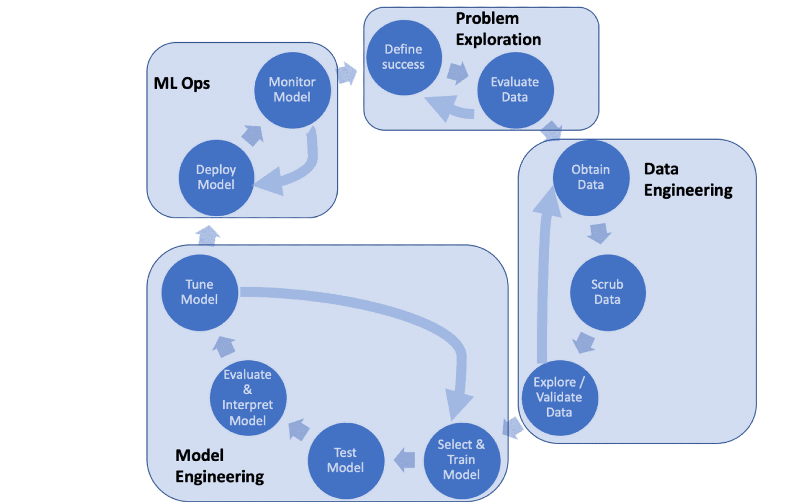
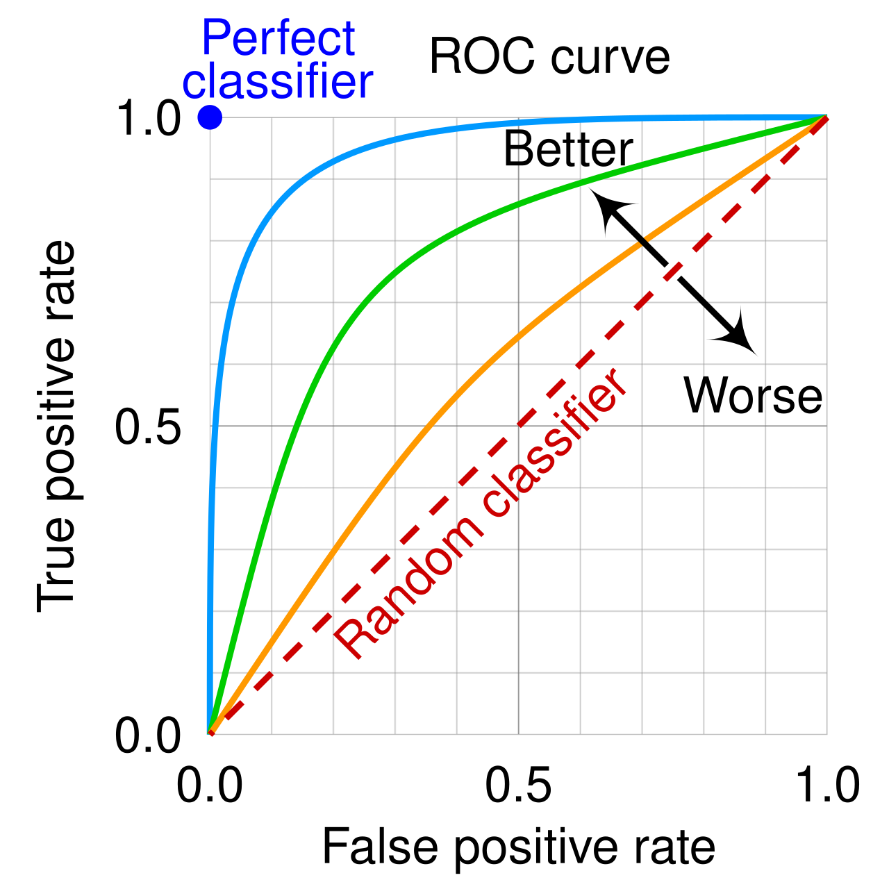

## Overview: The Role of Training Data



## Model Selection

- Choosing the right algorithm and hyperparameters is critical for good performance.
- We rely on validation techniques to compare models fairly and avoid overfitting.

## Fitting and Generalization

- **Fit**: training a model means adjusting its parameters to minimize error on the training data.
- Goal is **generalization** – low error on unseen data, not just the training set.

## Underfitting vs Overfitting

| Phenomenon      | Description | Symptoms |
|-----------------|-------------|----------|
| Underfitting     | Model too simple for the data | high error on train and test |
| Overfitting      | Model too complex; memorizes noise | low train error but high test error |
| Just right (generalizes) | Complexity matches data | low error on both train and test |


## plot compare

> **Visualization:** imagine a tight linear line vs an overly wiggly curve.

```{python}
#| echo: false
import numpy as np
import matplotlib.pyplot as plt
from sklearn.linear_model import LinearRegression
from sklearn.preprocessing import PolynomialFeatures
from sklearn.pipeline import make_pipeline

# synthetic data for visualization
np.random.seed(0)
X_vis = np.sort(np.random.rand(30) * 10)[:, None]
y_vis = np.sin(X_vis).ravel() + np.random.normal(0, 0.3, X_vis.shape[0])

plt.figure(figsize=(12,4))
for i, d in enumerate([1, 4, 15], 1):
    model = make_pipeline(PolynomialFeatures(d), LinearRegression())
    model.fit(X_vis, y_vis)
    X_test = np.linspace(0,10,100)[:, None]
    y_pred = model.predict(X_test)
    plt.subplot(1,3,i)
    plt.scatter(X_vis, y_vis, facecolors='none', edgecolors='b')
    plt.plot(X_test, y_pred, 'r-')
    plt.title(f'degree {d}')
    plt.ylim(-3, 3)
plt.suptitle('Underfitting (left), good fit (center), overfitting (right)')
plt.show()
```

## Train‑Test Curves

```{python}
#| echo: false
# now plot training vs test error as complexity increases
from sklearn.model_selection import train_test_split
from sklearn.metrics import mean_squared_error

X_train_vis, X_test_vis, y_train_vis, y_test_vis = train_test_split(X_vis, y_vis, test_size=0.3, random_state=1)

degrees = range(1, 16)
train_err = []
test_err = []
for d in degrees:
    model = make_pipeline(PolynomialFeatures(d), LinearRegression())
    model.fit(X_train_vis, y_train_vis)
    train_err.append(mean_squared_error(y_train_vis, model.predict(X_train_vis)))
    test_err.append(mean_squared_error(y_test_vis, model.predict(X_test_vis)))

plt.figure()
plt.plot(degrees, train_err, 'o-', label='train error')
plt.plot(degrees, test_err, 'o-', label='test error')
plt.xlabel('Polynomial degree (model complexity)')
plt.ylabel('MSE')
plt.legend()
plt.title('Train vs Test error demonstrating under/overfitting')
plt.show()
```


## Cross‑Validation Techniques

The basic idea is to partition data into folds, train on some and validate on others.

- **k‑fold CV**: split into k equal parts, rotate which fold is held out.
- **Stratified k‑fold CV**: split into k equal parts, rotate which fold is held out.
- **Leave‑one‑out (LOO)**: extreme case of k‑fold where k equals number of samples. Good for small datasets but expensive.


## When to Use Which

1. **LOO**: small datasets, high variance & high compute
2. **k‑fold**: standard choice, use 5 or 10 folds
3. **Stratified**: always for classification unless data is balanced


---

## Evaluation Metrics Provided by scikit-learn

- confusion_matrix
- accuracy
- precision
- recall
- f1
- roc_auc

## Confusion Matrix

Real vs Predicted table form:

|               | Predicted Positive | Predicted Negative |
|---------------|--------------------|--------------------|
| **Actual Positive** | TP                 | FN                 |
| **Actual Negative** | FP                 | TN                 |

## Accuracy

$$\text{Accuracy} = \frac{TP + TN}{TP + TN + FP + FN}$$

## Precision / Recall / F1

$$Precision = \frac{TP}{TP + FP}$$
$$Recall (Sensitivity) = \frac{TP}{TP + FN}$$
$$F1 score = 2 \cdot \frac{\text{precision} \cdot \text{recall}}{\text{precision} + \text{recall}}$$

## ROC Curve & AUC

:::: {.columns}

::: {.column width="50%"}
- **ROC** plots True Positive Rate vs False Positive Rate.
- **AUC** is area under the curve: a summary of separability.
:::

::: {.column width="50%"}

:::

::::


## Cross‑Validation: k‑fold CV, LOO
```python
from sklearn.model_selection import cross_val_score, LeaveOneOut
scores = cross_val_score(model, X, y, cv=5)
loo_scores = cross_val_score(model, X, y, cv=LeaveOneOut())
```

## Stratified k‑fold CV
```python
from sklearn.model_selection import StratifiedKFold
skf = StratifiedKFold(n_splits=5)
for train_idx, val_idx in skf.split(X, y):
    # use the indices to split
    pass
```

## What Are Hyperparameters?

- **Parameters** are learned from training data (weights, coefficients).
- **Hyperparameters** are set before training (e.g. regularization strength, number of trees).
- They control model complexity, learning rate, and other behaviors.

Example: in `SVC(C=1.0, kernel='rbf')`, `C` and `kernel` are hyperparameters; the support vectors are parameters.

Once set, the model is trained with those hyperparameters using data.

## Example hyperparameters

| Model                  | Typical hyperparameters                         |
|------------------------|-------------------------------------------------|
| SVM (SVC)              | `C`, `kernel`, `gamma`                          |
| RandomForestClassifier | `n_estimators`, `max_depth`, `min_samples_split`|
| KNeighborsClassifier   | `n_neighbors`, `weights`, `p`                   |
| LogisticRegression     | `C`, `penalty`, `solver`                        |

## Hyperparameter Tuning & Common Algorithms

Hyperparameters are settings that cannot be learned from data; tuning them can dramatically improve performance.

- **Grid search**: exhaustive search over a predefined grid (see next slide for code).
- **Randomized search**: sample a fixed number of parameter settings from distributions.
- **Bayesian optimization** (libraries like `scikit-optimize`, `optuna`): smarter exploration.

## Grid Search

Grid search exhaustively explores a specified parameter grid. Each combination is evaluated using cross‑validation, and the best set is selected based on a scoring metric.

Key points:

- Define a parameter grid as dict of lists.
- Use `GridSearchCV` to wrap an estimator.
- It runs `fit` repeatedly on CV folds, so computational cost grows with grid size.
- For large spaces, consider `RandomizedSearchCV` or Bayesian optimization.

## Example: Breast Cancer Dataset

We'll use scikit-learn's built-in *breast cancer* toy dataset to illustrate model selection.

```{python}
#| echo: true

from sklearn.datasets import load_breast_cancer
from sklearn.model_selection import train_test_split, GridSearchCV
from sklearn.svm import SVC
from sklearn.tree import DecisionTreeClassifier
from sklearn.ensemble import RandomForestClassifier
from sklearn.metrics import classification_report

# load data
X, y = load_breast_cancer(return_X_y=True)

X_train, X_test, y_train, y_test = train_test_split(X, y,
                                                        test_size=0.2,
                                                        random_state=42)
```

## Grid Search with Cross‑Validation

```{python}
#| echo: true

param_grid = {
    'C': [0.1, 1, 10],
    'kernel': ['linear', 'rbf'],
    'gamma': ['scale', 'auto']
}

svc = SVC()
grid = GridSearchCV(svc, param_grid, cv=5, scoring='accuracy')
grid.fit(X_train, y_train)
print('Best params:', grid.best_params_)
print('Best CV score:', grid.best_score_)

best_model = grid.best_estimator_
y_pred = best_model.predict(X_test)
print(classification_report(y_test, y_pred))
```

- The grid search tries combinations of hyperparameters and evaluates with 5‑fold CV.
- Best model is then tested on the held‑out test set for an unbiased estimate.

---

## Comparison: Multiple Algorithms

```{python}
#| echo: true

models = [
    ('svc', SVC()),
    ('dt', DecisionTreeClassifier()),
    ('rf', RandomForestClassifier())
]

for name, model in models:
    grid = GridSearchCV(model, {}, cv=5, scoring='accuracy')
    grid.fit(X_train, y_train)
    print(name, 'CV acc', grid.best_score_)
```

- Here we compare SVM, decision tree, and random forest using default settings.
- The model with highest cross‑validation accuracy is preferred, but hyperparameter tuning is often necessary.

---

## Accuracy

```{python}
#| echo: true

from sklearn.metrics import accuracy_score
accuracy = accuracy_score(y_test, y_pred)
print('Test accuracy', accuracy)
```

---

## Precision / Recall / F1

```{python}
#| echo: true

from sklearn.metrics import precision_score, recall_score, f1_score
print('Precision', precision_score(y_test, y_pred))
print('Recall', recall_score(y_test, y_pred))
print('F1', f1_score(y_test, y_pred))
```

---

## Confusion Matrix

```{python}
#| echo: true

from sklearn.metrics import confusion_matrix
print(confusion_matrix(y_test, y_pred))
```

---

## ROC Curve & AUC calculation

```{python}
#| echo: true

from sklearn.svm import SVC
from sklearn.metrics import roc_auc_score, roc_curve, accuracy_score
import matplotlib.pyplot as plt

# train a simple classifier (could be result of grid search)
model = SVC(probability=True, kernel='rbf', C=1.0).fit(X_train, y_train)
y_pred = model.predict(X_test)
print('Test accuracy', accuracy_score(y_test, y_pred))

proba = model.predict_proba(X_test)[:,1]
print('ROC AUC', roc_auc_score(y_test, proba))
```

## ROC Curve plotting
```{python}
#| echo: true
# compute ROC curve
fpr, tpr, thresholds = roc_curve(y_test, proba)
plt.figure()
plt.plot(fpr, tpr, label=f'AUC = {roc_auc_score(y_test, proba):.3f}')
plt.plot([0,1], [0,1], 'k--', label='random')
plt.xlabel('False Positive Rate')
plt.ylabel('True Positive Rate')
plt.title('ROC Curve')
plt.legend(loc='lower right')
plt.show()
```


