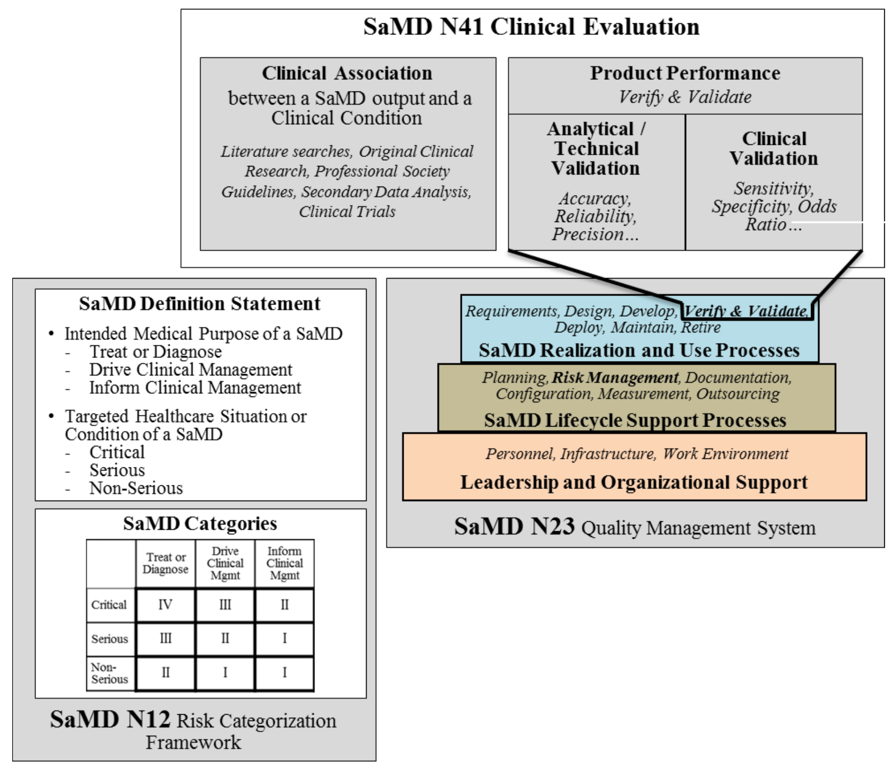
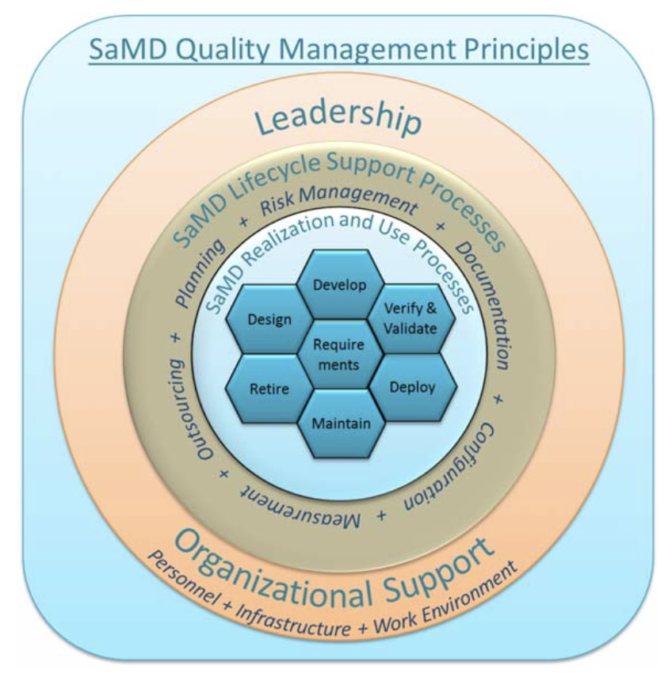

## Defining AI in Regulated Healthcare
*   **Artificial Intelligence (AI):** Systems capable of performing tasks requiring human-like intelligence, such as learning, reasoning, and pattern recognition.
*   **GxP Context:** In pharmacy and medical devices, AI is defined as algorithms integrated into tools that learn from data to perform automated tasks without explicit human programming for every step.
*   **Core Applications:**
    *   Optimizing clinical decision-making and personalized patient treatment.
    *   Accelerating drug discovery and repurposing.
    *   Streamlining administrative tasks like billing, documentation, and inventory management.

## Performance Metrics and Transparency
*   **Model Cards:** Standardized documents used to build trust by detailing a model’s characteristics, training data, and ethical considerations.
*   **Key Metrics for GxP Evaluation:**
    *   **Accuracy:** Overall correctness of predictions.
    *   **Precision/Recall:** Balance between correct positive identifications and missing potential cases.
    *   **F1 Score:** The harmonic mean of precision and recall, vital for rare disease scenarios.
    *   **ROC-AUC:** Measures a model's capacity to distinguish between classes.

---

## Ethical Foundations

The use of AI in healthcare must align with four foundational medical ethics principles:

1.  **Autonomy:** Respecting a patient's right to self-determination.
2.  **Beneficence:** The responsibility to "do good."
3.  **Non-maleficence:** The responsibility to "do no harm."
4.  **Justice:** Treating all patients equally and equitably.

**Trustworthy AI** (EU Framework) must be lawful, ethical, and technically robust.

---

## Regulatory Compliance Landscape

:::{style="font-size: 0.9em;"}
*   **Data Protection:** Adherence to HIPAA (USA) and GDPR (Europe) is mandatory to protect sensitive patient information processed by AI.
*   **Medical Device Regulations:**
    *   **USA:** Regulated by the FDA under Digital Health and Software as a Medical Device (SaMD) frameworks.
    *   **Europe:** Governed by the Medical Device Regulation (MDR) to ensure safety and clinical evaluation.
*   **Human-Centric Approach:** AI must support, not replace, the critical thinking and professional judgment of pharmacists and clinicians.
:::
## SaMD landscape {visibility="hidden"}




## SAMD: Possible Framework for Risk Categorization ^[IMDRF/SaMD WG/N12] {visibility="hidden"}


| | **Treat or Diagnose** | **Drive Clinical Management** | **Inform Clinical Management** |
|--|--|--|--|
| Critical | IV | III | II |
| Serious | III | II | I |
| Non-Serious | II | I | I |


## SAMD: Quality Management System ^[IMDRF/SaMD WG/N23] {visibility="hidden"}



## SAMD: Clinical Evaluation ^[IMDRF/SaMD WG/N42] {visibility="hidden"}

:::: {.columns}

::: {.column width="33%"}
**Valid Clinical Association**

- valid clinical
- association between 
- output and 
- targeted clinical
- condition?
:::

::: {.column width="33%"}
**Analytical Validation**

- correctly
- process input data to generate
- accurate, reliable, and precise
- output data?
:::

::: {.column width="33%"}
**Clinical Validation**

- use accurate, reliable, and precise
- output data achieve intended
- purpose in target population
- in context of clinical care?
:::

::::


## Related laws

- Personal Data Protection Act 2019 (PDPA)
- General Data Protection Regulation 2016 (GDPR)
- Health Insurance Portability and Accountability Act of 1996 (HIPAA)
- etc.


## [Good Machine Learning Practices (GMLP) ^[https://www.fda.gov/medical-devices/software-medical-device-samd/good-machine-learning-practice-medical-device-development-guiding-principles] ]{.r-fit-text}

- Man (1, 7)
- Good Software Engineering and Security Practices (2)
- Data (3, 4, 5)
- Model Design (6)
- Testing (8)
- User (9)
- Performance monitoring (10)


## Good Machine Learning Practice (GMLP)^[https://www.fda.gov/medical-devices/software-medical-device-samd/good-machine-learning-practice-medical-device-development-guiding-principles] ]{.r-fit-text}

*   Multi-disciplinary expertise must be leveraged throughout the lifecycle.
*   Training datasets must be independent of test sets to prevent bias.
*   Selected reference standards must be "fit-for-purpose".
*   Models must be assessed for performance in the intended use environment, focusing on the human-AI team.
*   Deployed models require ongoing real-world monitoring to manage retraining risks.

---

## Predetermined Change Control Plans (PCCP)

The FDA allows for iterative AI modifications without a new marketing submission if a PCCP is established.

*   **Description of Modifications:** Enumerates specific, planned changes to characteristics or performance.
*   **Modification Protocol:** Detailed methods for developing, validating, and implementing changes.
*   **Impact Assessment:** Assessment of benefits and risks introduced by planned modifications.
*   **Goal:** To maintain device safety and effectiveness across intended populations as the AI evolves.

---

## Implementation Barriers

*   **Algorithmic Bias:** Systematic discrimination stemming from unrepresentative training data.
*   **Model Drift:** Degradation of performance over time due to changes in underlying data patterns.
*   **Overfitting:** When a model learns "noise" instead of the signal, leading to poor generalization on new patients.
*   **Integration:** Navigating complex clinical workflows and high initial infrastructure costs.

## Ethical guideline

:::: {.columns style="font-size: 0.8em;"}

::: {.column width="50%"}

- Digital Thailand - AI Ethics Guideline
- Competitiveness and Sustainability Development
- Laws Ethics and International Standards
- Transparency and Accountability
- Security and Privacy
- Fairness
- Reliability

:::

::: {.column width="50%"}

- UNESCO
    - Proportionality and Do No Harm
    - Safety and Security
    - Right to Privacy and Data Protection
    - **Multi-stakeholder and Adaptive Governance & Collaboration**
    - Responsibility and Accountability
    - Transparency and Explainability
    - **Human Oversight and Determination**
    - Sustainability
    - Awareness & Literacy
    - Fairness and Non-Discrimation

:::

::::

## The AI Lifecycle in GxP

```{dot}
digraph G {
    rankdir=LR;
    node [shape=box, fontname="Helvetica", style=filled, fillcolor=lightblue];
    
    Data [label="Data Collection\n(Representative & Diverse)", fillcolor=lightgrey];
    Development [label="Development\n(Training & Tuning)"];
    Validation [label="Performance Validation\n(Independent Test Sets)"];
    Regulatory [label="Regulatory Review\n(FDA/MDR Compliance)"];
    Deployment [label="Deployment\n(GxP Environment)"];
    Monitoring [label="Real-World Monitoring\n(Bias & Drift Detection)"];
    Retraining [label="Iterative Retraining\n(via PCCP)"];

    Data -> Development;
    Development -> Validation;
    Validation -> Regulatory;
    Regulatory -> Deployment;
    Deployment -> Monitoring;
    Monitoring -> Retraining;
    Retraining -> Development [label="Loop back"];
}
